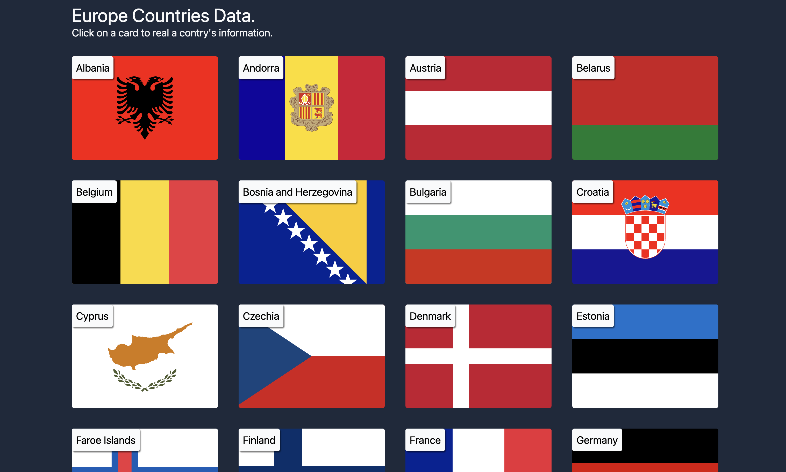

# 🌍 Europe Countries Data

A responsive web application displaying data about European countries, built with **React** and **Vite**. This project fetches and displays information about countries in Europe, allowing users to view details such as languages, capital, and population. Created during a front-end development training with [École du Web](https://www.ecole-du-web.net/).

## 📖 Description

This application provides a visual interface to explore various European countries. Users can click on a country card to view detailed information about that country, including its languages, capital, and population.

## 🚀 Features

- 🌐 Fetches and displays data from the [REST Countries API](https://restcountries.com/).
- 📝 Displays detailed country information in a modal.
- 🔍 Sorted list of countries by name.
- 🖼️ Displays country flags.
- 🔄 Responsive design for various screen sizes.

## 🛠️ Tech Stack

- **React** with functional components & hooks
- **Vite** for fast development and build
- **Tailwind CSS** for styling
- **ESLint** for linting
- **Fetch API** for data retrieval

## 📦 Installation

```bash
git clone https://github.com/your-username/PP-geoData--react.git
cd PP-geoData--react
npm install
```

### ▶️ Usage

Start the app in development mode:

```bash
npm run dev
```

To build the app for production:

```bash
npm run dev
```

To preview the production build:

```bash
npm run preview
```

## 🧠 What I learned

- Fetching data from an external API using the Fetch API.
- Managing component state with useState.
- Using useEffect for side effects in functional components.
- Creating a responsive grid layout with Tailwind CSS.
- Implementing modal dialogs using React portals.
- Sorting and mapping data to render dynamic content.

## 🖼️ Screenshots


